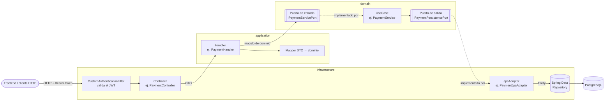
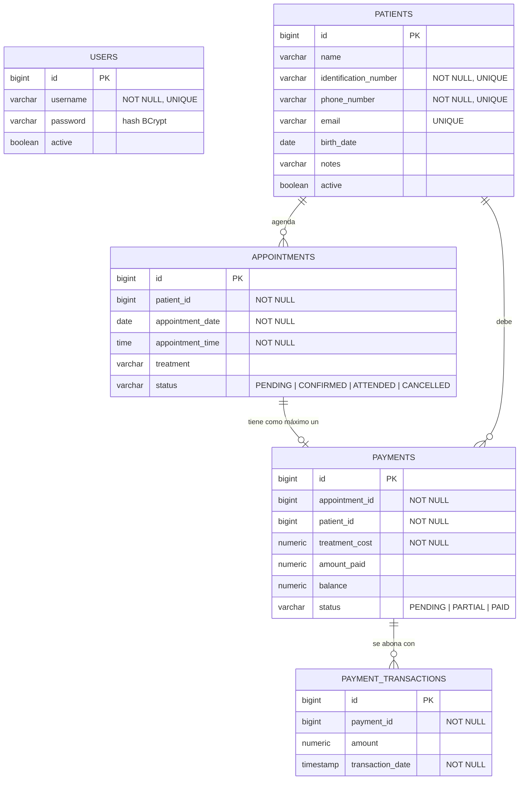
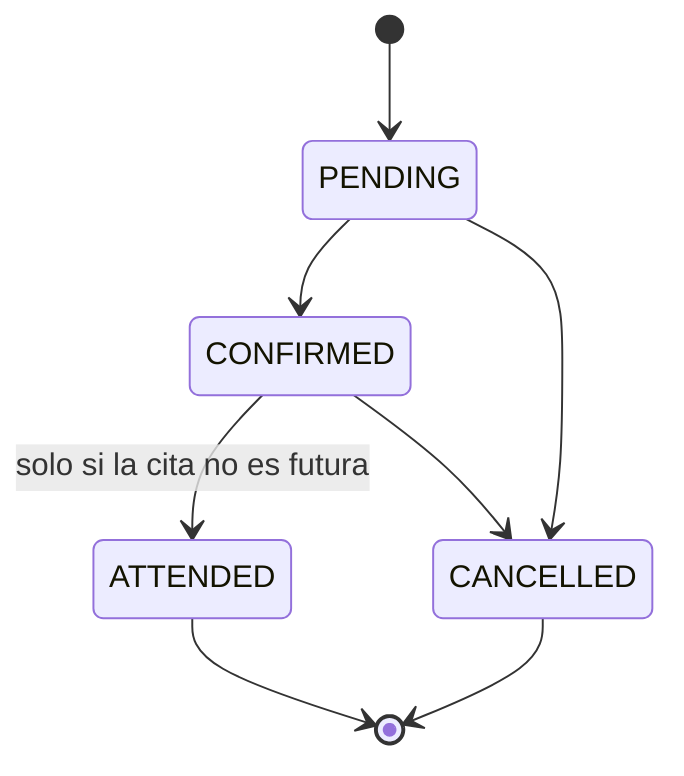

# DentalCore

API REST para la gestión de un consultorio odontológico: pacientes, agenda de citas, pagos con abonos parciales y un dashboard de ingresos.

> **Sistema en uso real.** DentalCore lo usa hoy un consultorio para su operación diaria. Por eso **no hay demo pública, cuenta de prueba ni credenciales** en este repositorio, y ningún ejemplo de este README corresponde a datos reales: todos los nombres, números y montos son inventados.

El frontend está en un repositorio aparte (**LosCardonas-Front**): HTML, Bootstrap 5 y JavaScript plano.

---

## Funcionalidades

| Módulo | Qué hace |
|---|---|
| **Usuarios** | Registro y login con usuario y contraseña. Devuelve un JWT que se usa en el resto de endpoints. |
| **Pacientes** | Crear, editar, listar/buscar por nombre e inactivar pacientes (baja lógica). |
| **Citas** | Agendar citas, consultar la agenda de un día y cambiar el estado (pendiente → confirmada → atendida / cancelada). |
| **Pagos** | Registrar el pago de una cita (total o parcial), sumar abonos, ver el historial de pagos del paciente con su saldo pendiente y el detalle de cada abono. |
| **Dashboard** | Resumen del día (citas por estado y total recaudado) e ingresos por semana, mes o año. |

## Stack

Versiones tomadas de `build.gradle` y del wrapper de Gradle:

| Tecnología | Versión |
|---|---|
| Java | 21 (toolchain) |
| Spring Boot | 3.5.4 (web, security, validation, data-jpa) |
| Gradle (wrapper) | 9.5.1 |
| PostgreSQL (driver) | el que gestiona Spring Boot 3.5.4 |
| JJWT | 0.12.7 |
| springdoc-openapi (Swagger UI) | 2.8.9 |
| MapStruct | 1.6.3 |
| Lombok | el que gestiona Spring Boot 3.5.4 |
| Flyway | declarado como dependencia, pero sin migraciones (ver [Deuda técnica](#deuda-técnica-conocida)) |
| Tests | JUnit 5 + Mockito (vía `spring-boot-starter-test`) |

## Arquitectura

El proyecto sigue una **arquitectura hexagonal** (puertos y adaptadores) con tres capas:

```
src/main/java/com/lc/dentalcore
├── domain/            # Núcleo: sin dependencias de Spring
│   ├── model/         # Patient, Appointment, Payment, PaymentTransaction, User, enums...
│   ├── usecase/       # Reglas de negocio: AppointmentService, PatientService, PaymentService, UserService
│   ├── api/           # Puertos de entrada (IxxxServicePort) y servicios externos (token, contraseña)
│   ├── spi/           # Puertos de salida (IxxxPersistencePort)
│   └── exception/     # Excepciones de dominio
├── application/       # Orquestación: handlers, DTOs y mappers DTO <-> dominio (MapStruct)
└── infrastructure/    # Adaptadores: controllers REST, JPA, seguridad JWT, configuración
```

Los casos de uso son clases Java planas. Se instancian como beans en `infrastructure/config/BeanConfiguration`, donde se les inyectan los adaptadores que implementan sus puertos.

### Flujo de una petición



## Modelo de datos

Entidades JPA en `infrastructure/output/jpa/entity`. Las relaciones son **lógicas, por id**: las entidades guardan `patient_id`, `appointment_id` y `payment_id` como columnas simples, sin `@ManyToOne` ni llaves foráneas declaradas en JPA.



## Reglas de negocio implementadas

Todas viven en `domain/` y están cubiertas por tests unitarios.

**Citas (`AppointmentService`)**
- No se puede agendar en una fecha pasada, ni hoy a una hora que ya pasó (`PastAppointmentTimeException`).
- No puede haber dos citas en la misma fecha y hora (`DuplicateAppointmentException`). El consultorio maneja una sola agenda.
- El paciente debe existir y estar activo.
- Toda cita nueva nace en `PENDING`, sin importar el estado que envíe el cliente.
- Transiciones de estado permitidas:



  `PENDING → ATTENDED` y `CONFIRMED → PENDING` se rechazan. Una cita `ATTENDED` o `CANCELLED` ya no se puede modificar.

**Pacientes (`PatientService`)**
- Formatos: teléfono de 7 a 20 dígitos, email válido, documento de al menos 3 dígitos.
- Email, documento y teléfono deben ser únicos al crear.
- Inactivar es una baja lógica, y no se puede inactivar dos veces.

**Pagos (`PaymentService`)**
- Una cita tiene como máximo un pago.
- El valor pagado debe estar entre 0 y el costo del tratamiento.
- El estado se calcula a partir del saldo: `PENDING` si no se ha pagado nada, `PARTIAL` si hay saldo pendiente y `PAID` si el saldo es 0.
- Cada abono debe ser mayor que 0 y no puede superar el saldo.
- Cada pago inicial y cada abono quedan registrados como una `PaymentTransaction` con fecha y hora. De ahí salen el recaudo del día y los ingresos por periodo.
- El saldo pendiente del paciente es la suma de los saldos de todos sus pagos.
- Ingresos: semana de lunes a domingo, mes calendario o año calendario, según la fecha de referencia.

**Usuarios (`UserService`)**
- Contraseña de al menos 8 caracteres, con una mayúscula y un número. Se guarda con BCrypt.
- El username debe ser único.
- El login devuelve un JWT firmado con HS256.

## Endpoints

La documentación interactiva queda en `/swagger-ui/index.html` al levantar la app en local.

| Método | Ruta | Descripción |
|---|---|---|
| `POST` | `/users` | Registrar usuario |
| `POST` | `/users/login` | Login → `{ "token": "..." }` |
| `GET` | `/patients?name=` | Listar pacientes o buscar por nombre |
| `POST` | `/patients` | Crear paciente |
| `PUT` | `/patients/{id}` | Editar paciente |
| `PATCH` | `/patients/{id}/inactivate` | Inactivar paciente |
| `GET` | `/appointments?date=YYYY-MM-DD` | Agenda del día (hoy si no se envía fecha) |
| `POST` | `/appointments` | Crear cita |
| `PATCH` | `/appointments/{id}/status?status=` | Cambiar estado |
| `POST` | `/payments` | Registrar pago de una cita |
| `PUT` | `/payments/{id}/amount?mount=` | Sumar un abono |
| `GET` | `/payments/patient/{patientId}` | Historial de pagos y saldo del paciente |
| `GET` | `/payments/{paymentId}/transactions` | Abonos de un pago |
| `GET` | `/dashboard/summary` | Resumen del día |
| `GET` | `/dashboard/earnings?period=WEEKLY\|MONTHLY\|YEARLY&date=` | Ingresos por periodo |

Salvo `/users/**` y Swagger, todos los endpoints exigen el header `Authorization: Bearer <token>`.

Ejemplo de cuerpo para crear un paciente (datos inventados):

```json
{
  "name": "Paciente de Ejemplo",
  "identificationNumber": "1000000001",
  "phoneNumber": "3000000000",
  "email": "paciente@ejemplo.com",
  "birthDate": "2000-01-01",
  "notes": "Nota de ejemplo"
}
```

## Cómo ejecutarlo en local

> ⚠️ Usa siempre una base de datos **local y vacía**. No apuntes estas variables a la base del consultorio.

### 1. Variables de entorno

| Variable | Uso |
|---|---|
| `LC_DB_URL` | URL JDBC de PostgreSQL, ej. `jdbc:postgresql://localhost:5432/dentalcore_local` |
| `LC_DB_USERNAME` | Usuario de la base |
| `LC_DB_PASSWORD` | Contraseña de la base |
| `PRAGMA_JWT_KEY` | Secreto para firmar los JWT (HS256: mínimo 32 caracteres) |
| `PORT` | Opcional. Puerto HTTP (por defecto `8080`) |

### 2. PostgreSQL local

Por ejemplo, con Docker:

```bash
docker run --name dentalcore-pg-local -e POSTGRES_DB=dentalcore_local -e POSTGRES_USER=dentalcore -e POSTGRES_PASSWORD=cambia-esto -p 5432:5432 -d postgres:16
```

### 3. Esquema

> **Limitación conocida:** el repositorio **no incluye ningún script SQL ni migración**. `application.yml` usa `ddl-auto: none`, así que Hibernate no crea las tablas, y aunque Flyway está declarado como dependencia, no hay carpeta `db/migration`.

Hoy la única referencia del esquema son las entidades JPA, resumidas en el [diagrama ER](#modelo-de-datos). Para un entorno local hay que crear esas cinco tablas vacías a mano (`users`, `patients`, `appointments`, `payments`, `payment_transactions`). Agregar una migración inicial de Flyway está pendiente como mejora.

### 4. Levantar la app

```bash
./gradlew bootRun
```

Luego registra un usuario local con `POST /users` y usa `POST /users/login` para obtener el token.

CORS permite por defecto `http://localhost:5500` y `http://127.0.0.1:5500` (Live Server), que es donde suele correr el frontend en local.

## Tests

```bash
./gradlew test
```

Son **tests unitarios puros** con JUnit 5 y Mockito (`@ExtendWith(MockitoExtension.class)`). No levantan Spring ni se conectan a ninguna base de datos: todos los puertos de persistencia se mockean y todos los datos de prueba son inventados. `./gradlew build` pasa sin definir ninguna variable de entorno de base de datos.

| Clase | Qué cubre |
|---|---|
| `AppointmentServiceTest` | Cita válida → `PENDING`; fecha u hora pasada; horario ocupado; paciente inexistente o inactivo; transiciones de estado válidas e inválidas; `ATTENDED` en cita futura; agenda por fecha o de hoy |
| `PatientServiceTest` | Formatos de teléfono, email y documento; duplicados (email, documento, teléfono); edición; búsqueda por nombre vs. listado completo; inactivación |
| `PaymentServiceTest` | Estado `PENDING` / `PARTIAL` / `PAID` según el monto; montos inválidos; pago duplicado; abonos parciales, abono que completa el total y abono que excede el saldo; registro de transacciones; saldo total del historial; resumen del día; rangos semanal, mensual (incluido febrero bisiesto) y anual |
| `UserServiceTest` | Registro con contraseña codificada; username duplicado; política de contraseñas; login correcto, contraseña incorrecta y usuario inexistente |

En total son 56 métodos de test (81 ejecuciones, contando los casos parametrizados).

`DentalCoreApplicationTests.contextLoads()` está deshabilitado a propósito: levantar el contexto completo abre una conexión real con las variables `LC_DB_*`.

## Deuda técnica conocida

Todo lo siguiente se detectó revisando el código y escribiendo los tests. **No está corregido todavía.**

**Seguridad**
- **El registro de usuarios requiere autenticación.** `SecurityConfig` solo permite sin autenticación `POST /users/login` (y Swagger); `POST /users` exige el mismo JWT que el resto de la API.
- `JwtAuth.getAuthorities()` devuelve `null`: no hay roles.
- El login aplica la política de contraseñas antes de consultar el usuario, así que una contraseña con formato inválido devuelve 400 en lugar de 401.

**Validaciones y errores**
- `Patient.validate()` llama `email.matches(...)` aunque el DTO permite omitir el email. Un paciente sin email termina en `NullPointerException` (500), no en un 400. Además, un email vacío (`""`) se rechaza como inválido, así que en la práctica el email es obligatorio.
- Un email de paciente duplicado lanza `UsernameAlreadyExistsException`, cuyo mensaje es "Username already exists".
- `updatePatient` no revisa unicidad. Un documento, teléfono o email repetido llega a la restricción `UNIQUE` de la base, y como no hay manejador para `DataIntegrityViolationException`, responde 500.
- `POST /payments` no tiene `@Valid`: un `treatmentCost` o `amountPaid` nulo produce un `NullPointerException` (500).
- Un tratamiento con costo 0 y pago 0 queda en `PENDING`, no en `PAID`. El costo no se valida como mayor que 0.
- El backend permite registrar pagos para citas en cualquier estado, incluidas las canceladas. Solo el frontend limita el botón a citas confirmadas o atendidas.
- `MSG_INVALID_PERIOD` menciona un periodo `DAILY` que no existe en `PeriodType`.
- `GlobalExceptionHandler` no tiene un manejador genérico: cualquier excepción no prevista sale como el 500 por defecto de Spring.

**Reglas de negocio**
- `existsByDateAndTime` cuenta también las citas **canceladas**, así que un horario liberado por una cancelación no se puede volver a usar.
- `GET /patients` sin nombre devuelve también pacientes **inactivos**, mientras que la búsqueda por nombre solo devuelve activos.
- Las fechas "hoy" y "ahora" (`LocalDate.now()` / `LocalTime.now()`) dependen de la zona horaria del servidor. Si el servidor corre en UTC y el consultorio en otra zona, la validación de "cita en el pasado", el resumen del día y los ingresos pueden correrse de día.

**Arquitectura y proyecto**
- El dominio depende de `jakarta.transaction.Transactional` y de Lombok, así que no es 100 % independiente del framework.
- `DashboardSummary`, `EarningsResponse` y `PaymentTransaction` (modelos de dominio) se exponen directamente en los controllers, sin DTO.
- Nombres inconsistentes: `updateMount` / `mount` en lugar de `amount`.
- Flyway está como dependencia, pero no hay migraciones ni script de esquema (ver [Esquema](#3-esquema)).
- El test de contexto de Spring está deshabilitado. No hay tests de integración, ni de controllers, handlers o adaptadores.
- En `CustomAuthenticationFilter`, la verificación manual de expiración nunca se ejecuta, porque JJWT ya lanza una excepción al parsear un token expirado.

## Privacidad

Este sistema maneja datos de salud de personas reales, por eso:
- No hay demo pública ni cuenta de prueba.
- No hay capturas de pantalla con datos reales. Cualquier captura futura debe hacerse con datos ficticios.
- Los tests y los ejemplos de este README usan solo datos inventados.
